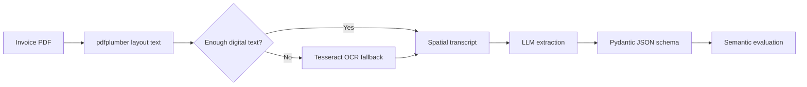

# Local Invoice Intelligence

A privacy-first invoice extraction benchmark and local AI pipeline for turning messy invoice PDFs into structured JSON.

The core finding: on a 297-document DocILE invoice benchmark, a fully local Qwen3 14B pipeline reached **81.76% average extraction accuracy**, while a frontier OpenAI GPT-5.5 API baseline reached **83.04%**. The local model was only **1.28 percentage points behind**, with no API cost and no document data leaving the machine.

This project is both an implementation and an experiment: how close can practical local models get to frontier API models on a real document extraction task?

The more important result is this: **GPT-5.5 itself never broke 85%.** The ceiling here is more about the task and not about which model you pick. And local models are already at that ceiling.

---

## Why This Matters

Invoice extraction is harder than it looks. Vendor names, addresses, totals, and issue dates appear in inconsistent layouts, across multiple pages, near distracting line items, subtotals, taxes, remittance blocks, and OCR noise.

Most teams solve this by sending documents to large cloud models. That works, but it introduces:

- recurring API cost,
- privacy and data residency concerns,
- vendor dependency,
- and uncertainty about whether frontier models are actually much better on the specific task.

This project tests that assumption directly.

---

## Headline Results

Direct baseline pipeline: `pdfplumber`/Tesseract transcript -> one model call -> structured JSON. No rescue pass.

Benchmark: **297 invoices** from the DocILE validation set.  
Metrics: semantic matching tolerant of OCR artifacts, currency formatting, date formatting, and minor address/name differences.

| Model | Provider | Total Avg | Vendor Name | Vendor Address | Gross Total | Issue Date | Avg Latency |
| :--- | :--- | ---: | ---: | ---: | ---: | ---: | ---: |
| `llama3.2:3b` | Local Ollama | 73.01% | 71.13% | 75.12% | 67.68% | 78.11% | ~5s/doc |
| `llama3.1:8b` | Local Ollama | 77.00% | 75.58% | 78.20% | 70.03% | 84.18% | ~15s/doc |
| `qwen3:14b` no thinking | Local Ollama | **81.76%** | 82.26% | 83.50% | 76.43% | 84.85% | ~18.3s/doc |
| `gpt-5.5` | OpenAI API | **83.04%** | 88.60% | 87.67% | 70.71% | 85.19% | 2.57s/doc |

A few things worth noting from this table:
 
- GPT-5.5 is stronger on **vendor identity fields** (name, address) — likely due to its large training corpus of company names and addresses.
- Qwen3 14B outperforms GPT-5.5 on **`amount_total_gross`** (76.43% vs 70.71%). This is the hardest field in the benchmark, and the larger model does not win here.
- GPT-5.5 cost **$1.96** for all 297 documents (~$0.0066/doc). At 50,000 invoices/month, that is ~$330/month in extraction cost alone before any orchestration or retry logic. The local pipeline cost is $0.
- The Qwen3 result uses `--ollama-thinking false`. Enabling thinking mode reduced accuracy and introduced JSON decode failures on this task.

---

## Architecture

The project deliberately separates perception from reasoning.



### 1. Deterministic Perception

The pipeline first extracts layout-preserving text using `pdfplumber(layout=True)`. This keeps columns and spatial relationships visible in plain text, which matters for invoices where the final total may be far away from its label or mixed with subtotals.

For scanned or weak-text pages, it falls back to OCR. Tesseract is the default because RapidOCR did not improve the benchmark in local tests.

### 2. Model-Agnostic Reasoning

The same transcript and schema can be sent to:

- local Ollama models such as `llama3.2:3b`, `llama3.1:8b`, and `qwen3:14b`,
- or OpenAI's API through the Responses API with Structured Outputs.

This makes comparisons fair: the model changes, but the PDF parsing, OCR fallback, schema, and scoring logic stay constant.

### 3. Controlled Reasoning Experiments

Qwen3 supports model-level thinking. The code exposes that separately from the older schema scratchpad:

- `--ollama-thinking false|true|low|medium|high`
- `ENABLE_THINKING=false` by default, so the Pydantic `reasoning_process` scratchpad is off for clean benchmarks.

In testing, Qwen3 thinking mode reduced early accuracy and introduced JSON decode failures, so the best Qwen3 result uses `--ollama-thinking false`.

---

## What Was Learned

The frontier API model did not produce a 95%+ result on this benchmark. GPT-5.5 reached **83.04%**, while local Qwen3 14B reached **81.76%**.

That result changes the decision calculus:

- If the requirement is maximum speed and API use is acceptable, GPT-5.5 is attractive at 2.57s/doc.
- If privacy and recurring cost matter, Qwen3 14B is surprisingly competitive.
- The hardest remaining field is `amount_total_gross`, where even GPT-5.5 struggled.
- Better extraction may require targeted validation, specialized total-detection logic, or selective retry rather than simply using a larger model.

---

## Quick Start

### Prerequisites

- Python 3.12+
- `uv`
- Tesseract installed locally
- Ollama for local model runs
- DocILE dataset available locally

The current config expects DocILE at:

```bash
/Users/sanja/Projects/docile/data/docile
```

Update `DOCILE_DATASET_PATH` in `src/config.py` if your dataset lives elsewhere.

### Install

```bash
git clone <repo-url>
cd local_invoice_intelligence
uv sync
```

Pull a local model:

```bash
ollama pull qwen3:14b
```

Run a small local benchmark:

```bash
uv run python src/eval_runner.py --pipeline baseline --provider ollama --limit 30 --model qwen3:14b --ollama-thinking false --output results/eval_report_qwen3_14b_30.json
uv run python src/evaluate_metrics.py --report results/eval_report_qwen3_14b_30.json
```

Run the full local benchmark:

```bash
caffeinate uv run python src/eval_runner.py --pipeline baseline --provider ollama --model qwen3:14b --ollama-thinking false --output results/eval_report_qwen3_14b_full_nothink.json
uv run python src/evaluate_metrics.py --report results/eval_report_qwen3_14b_full_nothink.json
```

---

## Running Model Comparisons

### Local Llama 3.2 3B

```bash
uv run python src/eval_runner.py --pipeline baseline --provider ollama --model llama3.2:3b --output results/eval_report_llama32_3b.json
uv run python src/evaluate_metrics.py --report results/eval_report_llama32_3b.json
```

### Local Llama 3.1 8B

```bash
uv run python src/eval_runner.py --pipeline baseline --provider ollama --model llama3.1:8b --output results/eval_report_llama31_8b.json
uv run python src/evaluate_metrics.py --report results/eval_report_llama31_8b.json
```

### Local Qwen3 14B

```bash
uv run python src/eval_runner.py --pipeline baseline --provider ollama --model qwen3:14b --ollama-thinking false --output results/eval_report_qwen3_14b.json
uv run python src/evaluate_metrics.py --report results/eval_report_qwen3_14b.json
```

### OpenAI GPT-5.5

Create `.env`:

```bash
OPENAI_API_KEY=sk-...
MODEL_PROVIDER=openai
OPENAI_MODEL=gpt-5.5
OPENAI_REASONING_EFFORT=low
OPENAI_MAX_OUTPUT_TOKENS=1024
```

Run:

```bash
uv run python src/eval_runner.py --pipeline baseline --provider openai --model gpt-5.5 --output results/eval_report_openai_gpt55_full.json
uv run python src/evaluate_metrics.py --report results/eval_report_openai_gpt55_full.json
```

The OpenAI path sends the extracted invoice transcript to the API. Use it only for benchmarking or when sending invoice text to a third party is acceptable.

---

## Using the Extractor in Code

The benchmark runner is the easiest entry point, but the extraction logic is also reusable from Python.

```python
import sys

sys.path.insert(0, "src")

from extractor import run_2_step_extraction
from schema import InvoiceExtractionBase

response = run_2_step_extraction(
    pdf_path="/path/to/invoice.pdf",
    schema=InvoiceExtractionBase,
    ocr_backend="tesseract",
    model="qwen3:14b",
    provider="ollama",
    ollama_thinking="false",
)

print(response["message"]["content"])
```

For production use, wrap this call in your own service boundary and replace the benchmark-specific DocILE paths with your document source.

---

## Configuration

Key settings live in `src/config.py` and can be overridden with environment variables.

| Setting | Purpose | Default |
| :--- | :--- | :--- |
| `MODEL_PROVIDER` | `ollama` or `openai` | `ollama` |
| `TEXT_MODEL` | Default local model | `qwen3:14b` |
| `OPENAI_MODEL` | OpenAI benchmark model | `gpt-5.5` |
| `OCR_BACKEND` | OCR fallback backend | `tesseract` |
| `ENABLE_THINKING` | Pydantic scratchpad schema | `false` |
| `OLLAMA_THINKING` | Qwen/Ollama thinking mode | `false` |
| `MODEL_TIMEOUT_SECONDS` | Per-document watchdog | `200` |

CLI flags override most model and pipeline choices:

```bash
uv run python src/eval_runner.py --help
```

---

## Evaluation Method

The scoring script compares four DocILE fields:

- `vendor_name`
- `vendor_address`
- `amount_total_gross`
- `date_issue`

It uses semantic matching rather than exact string equality:

- names and addresses use fuzzy token matching,
- amounts normalize currency symbols, commas, and OCR spacing,
- dates normalize common date formats and OCR confusions.

This is stricter than eyeballing results but more realistic than exact-match scoring for noisy document extraction.

---

## Next Steps

1. **Baseline-plus rescue:** Revisit the validation and targeted rescue pipeline for weak fields. The next likely gain is not a larger model, but selective correction of suspicious totals, dates, or ungrounded values.
2. **Gross total specialist:** Add deterministic candidate generation and ranking for `amount_total_gross`, since this remained hard even for GPT-5.5.
3. **Error analysis:** Group failures by OCR failure, prompt/context ambiguity, model hallucination, schema mismatch, and ground-truth ambiguity.
4. **Developer API:** Wrap the extractor in a small FastAPI service for local/private invoice processing.
5. **UI:** Build a lightweight interface for uploading PDFs, reviewing extracted fields, and correcting results.

---

## Tech Stack

- Python
- `pdfplumber` for layout-preserving text extraction
- PyMuPDF for PDF page rendering
- Tesseract OCR via `pytesseract`
- Ollama for local inference
- OpenAI Responses API for frontier-model benchmarking
- Pydantic schemas for structured extraction
- RapidFuzz and dateutil for evaluation
- DocILE dataset for benchmarking

---

Built by Sanjay as a practical benchmark for private, local document intelligence.
