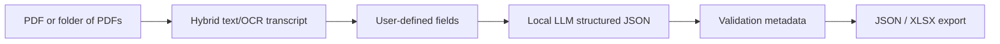

# Local Invoice Intelligence

A local, private PDF extraction toolkit for turning invoices and other business documents into structured JSON or Excel.

This project started as a serious local-vs-frontier-model extraction study and produced a strong practical result: a fully local `qwen3:14b` no-thinking baseline reached **81.76% average accuracy** on 297 DocILE validation invoices, landing only **1.28 percentage points behind GPT-5.5** at **83.04%**. The work included benchmark design, hybrid PDF/OCR transcription, structured-output prompting, semantic scoring, latency/cost comparison, and baseline-plus rescue experiments.

The key takeaway: local models are already close enough to frontier API performance for many private document extraction workflows. This repo now turns that research into a usable local toolkit while preserving the benchmark path as evidence.

Users define the fields they care about in YAML or JSON, point the tool at one PDF or a folder of PDFs, and run extraction locally through Ollama by default. Cloud APIs are optional and intended for comparison or cases where sending transcript text to a third party is acceptable.

The benchmark work is preserved as evidence, but it is no longer the product direction. The goal is a general document extraction system, not a DocILE-specific optimizer.

## What It Does



- Runs locally by default with Ollama.
- Accepts arbitrary user-defined fields with descriptions.
- Uses `pdfplumber` layout text first and OCR fallback for scanned pages.
- Produces JSON for one document or Excel for folders.
- Includes metadata: source file, latency, model, warnings, and transcript size.
- Keeps benchmark adapters separate from the product workflow.

## Quick Start

### Install

```bash
git clone <repo-url>
cd local_invoice_intelligence
uv sync
```

Install Tesseract locally, then pull a local model:

```bash
ollama pull qwen3:14b
```

### Define Fields

Create a YAML file like `configs/example_fields.yaml`:

```yaml
fields:
  - name: vendor_name
    description: The supplier, seller, or billing organization name visible on the document.
    type: string
    required: true
  - name: invoice_number
    description: The invoice identifier or document number, if present.
    type: string
  - name: issue_date
    description: The date the document was issued or created.
    type: date
  - name: total_due
    description: The final amount due, grand total, or balance payable.
    type: money
```

Supported `type` values are intentionally generic: `string`, `text`, `date`, `number`, `integer`, `money`, and `boolean`. Types are used for schema hints and validation metadata, not field-specific rules.

### Extract One PDF

```bash
uv run lii extract-one \
  --pdf /path/to/document.pdf \
  --fields configs/example_fields.yaml \
  --out results/document.json
```

### Extract a Folder to Excel

```bash
uv run lii extract-folder \
  --input-dir /path/to/pdfs \
  --fields configs/example_fields.yaml \
  --out results/extractions.xlsx \
  --artifacts-dir results/artifacts
```

The workbook has one row per PDF and one column per requested field, plus:

- `source_file`
- `latency_s`
- `model`
- `warnings`
- `transcript_chars`

When `--artifacts-dir` is set, the raw JSON result for each PDF is also written there.

## Streamlit Demo

The Streamlit app is a small portfolio/demo surface, not the main scalable interface.

```bash
uv run streamlit run app/streamlit_app.py
```

It supports PDF upload, editable field definitions, local extraction, JSON/table preview, and JSON download.

## Providers

Local Ollama is the default:

```bash
uv run lii extract-one --pdf invoice.pdf --fields configs/example_fields.yaml --out results/invoice.json --provider ollama --model qwen3:14b
```

OpenAI can be used explicitly:

```bash
OPENAI_API_KEY=sk-... uv run lii extract-one \
  --pdf invoice.pdf \
  --fields configs/example_fields.yaml \
  --out results/invoice_openai.json \
  --provider openai \
  --model gpt-5.5
```

The OpenAI path sends the extracted transcript to the API. Use it only when that privacy tradeoff is acceptable.

## Evaluation

Evaluation accepts arbitrary field definitions. Benchmarks are adapters, not product logic.

```bash
uv run lii eval \
  --dataset docile \
  --dataset-root /path/to/docile \
  --fields configs/example_fields.yaml \
  --out results/docile_report.json
```

Current adapters:

- `docile`: preserved invoice benchmark adapter.
- `sroie`: normalized `pdfs/` plus `annotations/*.json` layout.
- `kleister`: normalized `pdfs/` plus `annotations/*.json` layout for Kleister Charity/NDA style evaluation.

See `benchmarks/` for adapter notes.

## Benchmark Evidence

Direct baseline pipeline: `pdfplumber`/Tesseract transcript -> one model call -> structured JSON. No rescue pass.

Benchmark: **297 invoices** from the DocILE validation set.  
Metrics: semantic matching tolerant of OCR artifacts, currency formatting, date formatting, and minor address/name differences.

| Model | Provider | Total Avg | Vendor Name | Vendor Address | Gross Total | Issue Date | Avg Latency |
| :--- | :--- | ---: | ---: | ---: | ---: | ---: | ---: |
| `llama3.2:3b` | Local Ollama | 73.01% | 71.13% | 75.12% | 67.68% | 78.11% | ~5s/doc |
| `llama3.1:8b` | Local Ollama | 77.00% | 75.58% | 78.20% | 70.03% | 84.18% | ~15s/doc |
| `qwen3:14b` no thinking | Local Ollama | **81.76%** | 82.26% | 83.50% | 76.43% | 84.85% | ~18.3s/doc |
| `gpt-5.5` | OpenAI API | **83.04%** | 88.60% | 87.67% | 70.71% | 85.19% | 2.57s/doc |

The current best local result is Qwen3 14B no-thinking direct baseline at **81.76%**. Baseline-plus rescue was investigated with safer gating and shadow rescue, but it did not produce meaningful lift. Those experiments are preserved for reproducibility and should not drive the product architecture.

Reproduce the best local DocILE baseline:

```bash
bash benchmarks/docile/run_baseline.sh
```

Generated benchmark JSON files are not checked in. Download DocILE and re-run the scripts locally to verify the reported numbers.

## Repo Layout

```text
src/local_invoice_intelligence/
  extraction/   field configs, generic extraction pipeline, validation
  ocr/          hybrid PDF text/OCR transcript
  models/       Ollama and optional OpenAI providers
  batch/        folder processing
  export/       Excel export
  eval/         dataset adapters and field-driven scoring
  cli.py        developer CLI
benchmarks/
  docile/
  sroie/
  kleister/
experiments/
  docile_baseline_results/
configs/
  example_fields.yaml
app/
  streamlit_app.py
```

Legacy DocILE experiment scripts live under `benchmarks/docile/scripts/` so the top-level package stays focused on the general toolkit.
